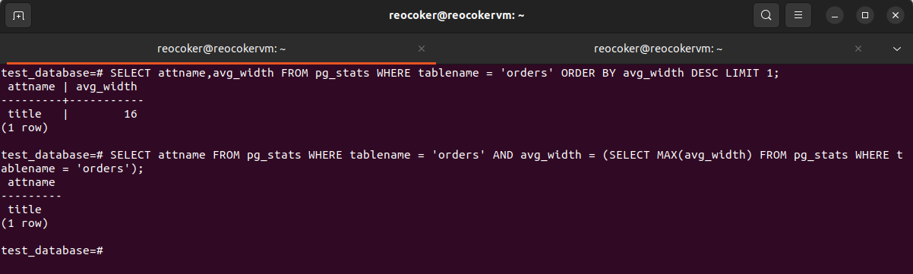

# Домашнее задание к занятию 4. «PostgreSQL»

## Задача 1

Используя Docker, поднимите инстанс PostgreSQL (версию 13). Данные БД сохраните в volume.

Подключитесь к БД PostgreSQL, используя `psql`.

Воспользуйтесь командой `\?` для вывода подсказки по имеющимся в `psql` управляющим командам.

**Найдите и приведите** управляющие команды для:

- вывода списка БД,
- подключения к БД,
- вывода списка таблиц,
- вывода описания содержимого таблиц,
- выхода из psql.

## Решение 1

1)  \l[+] [PATTERN]                      list databases

2)  \c{[DBNAME|- USER|- HOST|- PORT|-] | conninfo}connect to new database (currently "postgres")

3)  \dt[S+] [PATTERN]                    list tables
  
4)  \d[S+]  NAME                         describe table, view, sequence, or index

5) \q                     quit psql

## Задача 2

Используя `psql`, создайте БД `test_database`.

Изучите [бэкап БД](https://github.com/netology-code/virt-homeworks/tree/virt-11/06-db-04-postgresql/test_data).

Восстановите бэкап БД в `test_database`.

Перейдите в управляющую консоль `psql` внутри контейнера.

Подключитесь к восстановленной БД и проведите операцию ANALYZE для сбора статистики по таблице.

Используя таблицу [pg_stats](https://postgrespro.ru/docs/postgresql/12/view-pg-stats), найдите столбец таблицы `orders` 
с наибольшим средним значением размера элементов в байтах.

**Приведите в ответе** команду, которую вы использовали для вычисления, и полученный результат.

## Решение 2

## Задача 3

Архитектор и администратор БД выяснили, что ваша таблица orders разрослась до невиданных размеров и
поиск по ней занимает долгое время. Вам как успешному выпускнику курсов DevOps в Нетологии предложили
провести разбиение таблицы на 2: шардировать на orders_1 - price>499 и orders_2 - price<=499.

Предложите SQL-транзакцию для проведения этой операции.

Можно ли было изначально исключить ручное разбиение при проектировании таблицы orders?
## Решение 3

```sql
BEGIN;
CREATE TABLE orders_parted (
 id INT NOT NULL,
 title VARCHAR(200),
 price INT 
)
PARTITION BY RANGE (price);

CREATE TABLE orders_1 PARTITION OF orders_parted
 FOR VALUES FROM (499) TO (MAXVALUE);

CREATE TABLE orders_2 PARTITION OF orders_parted
 FOR VALUES FROM (0) TO (499);

INSERT INTO orders_parted (id, title, price) SELECT * FROM orders;

COMMIT;
```
**Можно ли было изначально исключить ручное разбиение при проектировании таблицы orders?**

При планировании секционирования мы должны руководствоваться или равномерным распределением данных или "обособлением" наиболеее часто используемых данных . И то и другое подразумевает анализ существующих данных . 
Т.е. изначально исключить ручное разбиение при проектировании таблицы возможно , только при наличии всех данных.

## Задача 4

Используя утилиту `pg_dump`, создайте бекап БД `test_database`.

Как бы вы доработали бэкап-файл, чтобы добавить уникальность значения столбца `title` для таблиц `test_database`?

```bash
pg_dump -d test_database -U postgres > ./backup/test_db.sql
```
