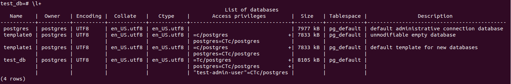
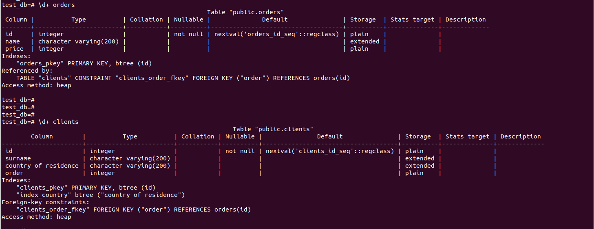
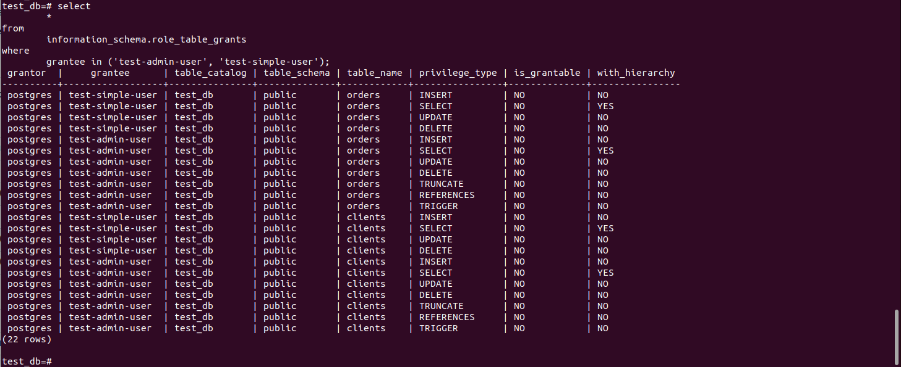
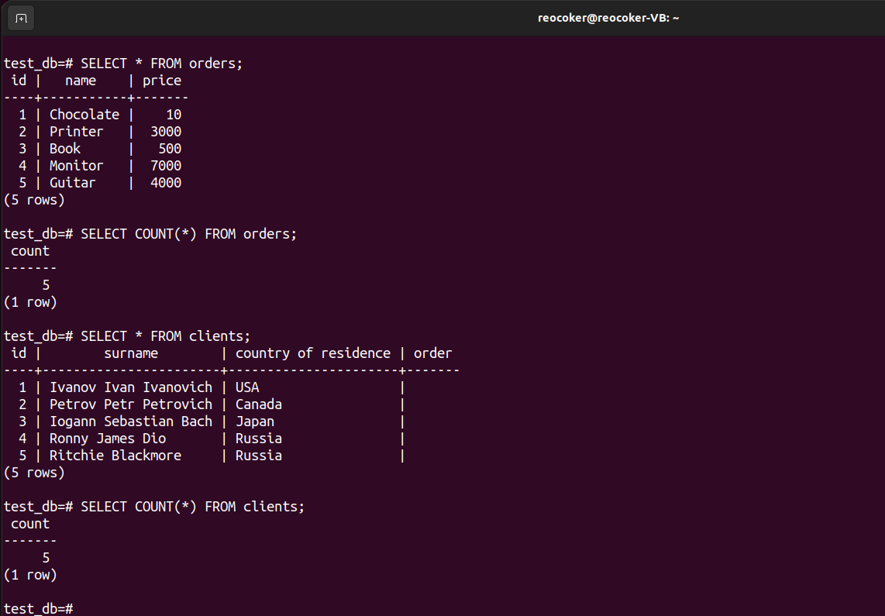
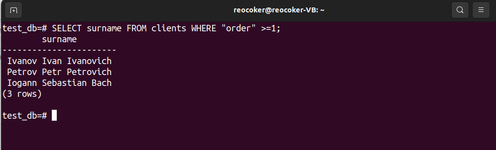
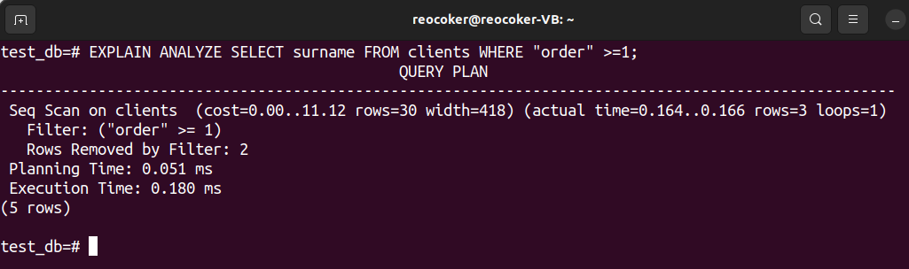

# Домашнее задание к занятию 2. «SQL»

## Введение

Перед выполнением задания вы можете ознакомиться с 
[дополнительными материалами](https://github.com/netology-code/virt-homeworks/blob/virt-11/additional/README.md).

## Задача 1

Используя Docker, поднимите инстанс PostgreSQL (версию 12) c 2 volume, 
в который будут складываться данные БД и бэкапы.

Приведите получившуюся команду или docker-compose-манифест.

## Решение 1
```                                                    
version: '3.1'

services:
  postgres:
    image: postgres:12
    container_name: netology_postgres
    ports:
      - 5432:5432
    environment:
      - PGDATA=/var/lib/postgresql/data
      - POSTGRES_HOST_AUTH_METHOD=trust
    volumes:
      - ./data:/var/lib/postgresql/data
      - ./backup:/backup
    restart: always
```
## Задача 2

В БД из задачи 1: 

- создайте пользователя test-admin-user и БД test_db;
- в БД test_db создайте таблицу orders и clients (спeцификация таблиц ниже);
- предоставьте привилегии на все операции пользователю test-admin-user на таблицы БД test_db;
- создайте пользователя test-simple-user;
- предоставьте пользователю test-simple-user права на SELECT/INSERT/UPDATE/DELETE этих таблиц БД test_db.

Таблица orders:

- id (serial primary key);
- наименование (string);
- цена (integer).

Таблица clients:

- id (serial primary key);
- фамилия (string);
- страна проживания (string, index);
- заказ (foreign key orders).

Приведите:

- итоговый список БД после выполнения пунктов выше;
- описание таблиц (describe);
- SQL-запрос для выдачи списка пользователей с правами над таблицами test_db;
- список пользователей с правами над таблицами test_db.

## Решение 2





```sql
  SELECT *
    FROM information_schema.role_table_grants
WHERE grantee IN ("test-admin-user", "test-simple-user");                                                   
```

## Задача 3

Используя SQL-синтаксис, наполните таблицы следующими тестовыми данными:

Таблица orders

|Наименование|цена|
|------------|----|
|Шоколад| 10 |
|Принтер| 3000 |
|Книга| 500 |
|Монитор| 7000|
|Гитара| 4000|

Таблица clients

|ФИО|Страна проживания|
|------------|----|
|Иванов Иван Иванович| USA |
|Петров Петр Петрович| Canada |
|Иоганн Себастьян Бах| Japan |
|Ронни Джеймс Дио| Russia|
|Ritchie Blackmore| Russia|

Используя SQL-синтаксис:
- вычислите количество записей для каждой таблицы.

Приведите в ответе:

    - запросы,
    - результаты их выполнения.

## Решение 3

```sql
SELECT COUNT(*) FROM orders;
SELECT COUNT(*) FROM clients;                                                   
```




## Задача 4

Часть пользователей из таблицы clients решили оформить заказы из таблицы orders.

Используя foreign keys, свяжите записи из таблиц, согласно таблице:

|ФИО|Заказ|
|------------|----|
|Иванов Иван Иванович| Книга |
|Петров Петр Петрович| Монитор |
|Иоганн Себастьян Бах| Гитара |

Приведите SQL-запросы для выполнения этих операций.

Приведите SQL-запрос для выдачи всех пользователей, которые совершили заказ, а также вывод этого запроса.
 
Подсказка: используйте директиву `UPDATE`.

## Решение 4

```sql
UPDATE clients SET "order" = (SELECT id FROM orders WHERE name = 'Book') WHERE surname = 'Ivanov Ivan Ivanovich';
UPDATE clients SET "order" = (SELECT id FROM orders WHERE name = 'Monitor') WHERE surname = 'Petrov Petr Petrovich';
UPDATE clients SET "order" = (SELECT id FROM orders WHERE name = 'Guitar') WHERE surname = 'Iogann Sebastian Bach';

SELECT surname FROM clients WHERE "order" >=1;                                                   
```
Вот здесь понял ,что при наполнении таблицы в "order" нужно было задать параметр NOT NULL, тогда бы запрос выглядел так :
```sql
SELECT surname FROM clients WHERE "order" NOT NULL;                                                   
```


## Задача 5

Получите полную информацию по выполнению запроса выдачи всех пользователей из задачи 4 
(используя директиву EXPLAIN).

Приведите получившийся результат и объясните, что значат полученные значения.

## Решение 5



EXPLAIN - оператор SQL, предоставляющий полную информацию выполнения запроса.

В нашем случае : 

Seq Scan — последовательное, блок за блоком, чтение данных таблицы clients.

cost - затратность операции. Первое значение 0.00 — затраты на получение первой строки. Второе — 11.12 — затраты на получение всех строк.

rows — количество возвращаемых строк при выполнении операции Seq Scan. 

width — средний размер одной строки в байтах.

actual time — реальное время в миллисекундах, затраченное для получения первой строки и всех строк соответственно.

rows — реальное количество строк, полученных при Seq Scan.

loops — сколько раз пришлось выполнить операцию Seq Scan.

Дальше идет применение фильтра , удаление строк несоответсвующих запросу.

planning time - время, затраченное на построение плана запроса и его оптимизацию.

execution time - продолжительность запуска и остановки исполнителя запроса, а также время выполнения всех сработавших триггеров.

## Задача 6

Создайте бэкап БД test_db и поместите его в volume, предназначенный для бэкапов (см. задачу 1).

Остановите контейнер с PostgreSQL, но не удаляйте volumes.

Поднимите новый пустой контейнер с PostgreSQL.

Восстановите БД test_db в новом контейнере.

Приведите список операций, который вы применяли для бэкапа данных и восстановления. 


