# Домашнее задание к занятию «Кластеры. Ресурсы под управлением облачных провайдеров»

### Цели задания 

1. Организация кластера Kubernetes и кластера баз данных MySQL в отказоустойчивой архитектуре.
2. Размещение в private подсетях кластера БД, а в public — кластера Kubernetes.

---
## Задание 1. Yandex Cloud

1. Настроить с помощью Terraform кластер баз данных MySQL.

 - Используя настройки VPC из предыдущих домашних заданий, добавить дополнительно подсеть private в разных зонах, чтобы обеспечить отказоустойчивость. 
 - Разместить ноды кластера MySQL в разных подсетях.
 - Необходимо предусмотреть репликацию с произвольным временем технического обслуживания.
 - Использовать окружение Prestable, платформу Intel Broadwell с производительностью 50% CPU и размером диска 20 Гб.
 - Задать время начала резервного копирования — 23:59.
 - Включить защиту кластера от непреднамеренного удаления.
 - Создать БД с именем `netology_db`, логином и паролем.

2. Настроить с помощью Terraform кластер Kubernetes.

 - Используя настройки VPC из предыдущих домашних заданий, добавить дополнительно две подсети public в разных зонах, чтобы обеспечить отказоустойчивость.
 - Создать отдельный сервис-аккаунт с необходимыми правами. 
 - Создать региональный мастер Kubernetes с размещением нод в трёх разных подсетях.
 - Добавить возможность шифрования ключом из KMS, созданным в предыдущем домашнем задании.
 - Создать группу узлов, состояющую из трёх машин с автомасштабированием до шести.
 - Подключиться к кластеру с помощью `kubectl`.
 - *Запустить микросервис phpmyadmin и подключиться к ранее созданной БД.
 - *Создать сервис-типы Load Balancer и подключиться к phpmyadmin. Предоставить скриншот с публичным адресом и подключением к БД.

Полезные документы:

- [MySQL cluster](https://registry.terraform.io/providers/yandex-cloud/yandex/latest/docs/resources/mdb_mysql_cluster).
- [Создание кластера Kubernetes](https://cloud.yandex.ru/docs/managed-kubernetes/operations/kubernetes-cluster/kubernetes-cluster-create)
- [K8S Cluster](https://registry.terraform.io/providers/yandex-cloud/yandex/latest/docs/resources/kubernetes_cluster).
- [K8S node group](https://registry.terraform.io/providers/yandex-cloud/yandex/latest/docs/resources/kubernetes_node_group).

--- 
## Решение 1

[Манифесты terraform](./files/task_bd/)

<br>В зоне "ru-central1-d" развернуть нельзя. 
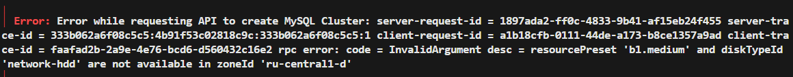

<br>Все остальные характеристики по тз ниже:
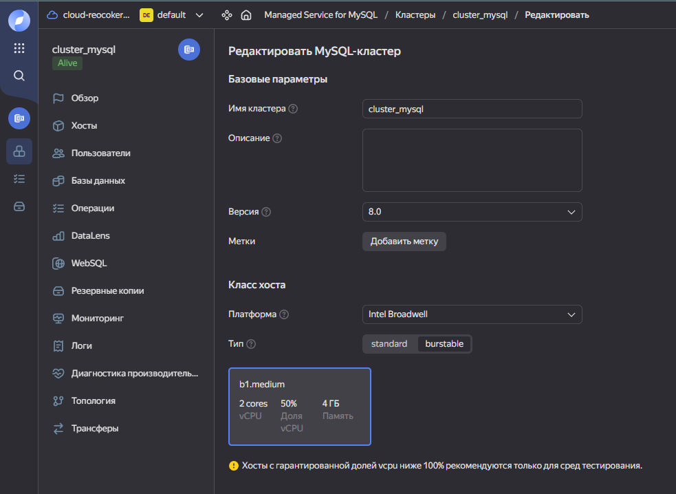
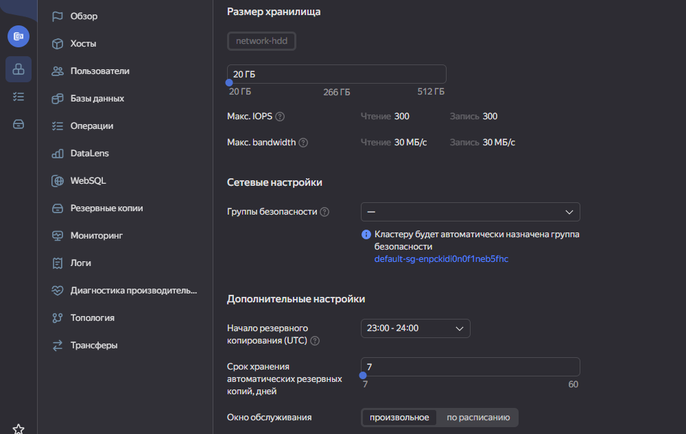
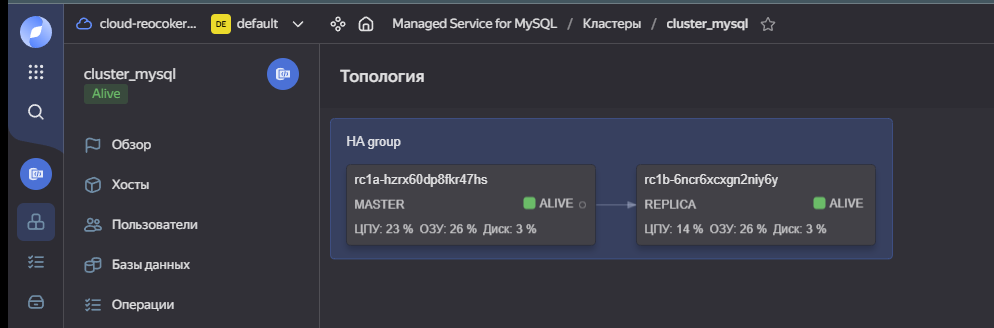
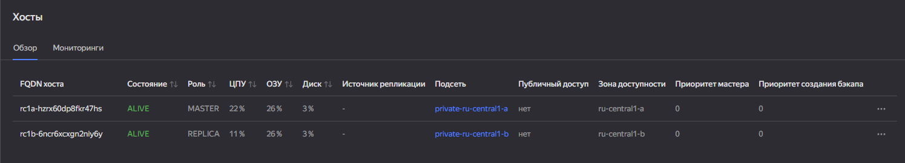

--- 
## Решение 2

[Манифесты terraform](./files/task_kub/)

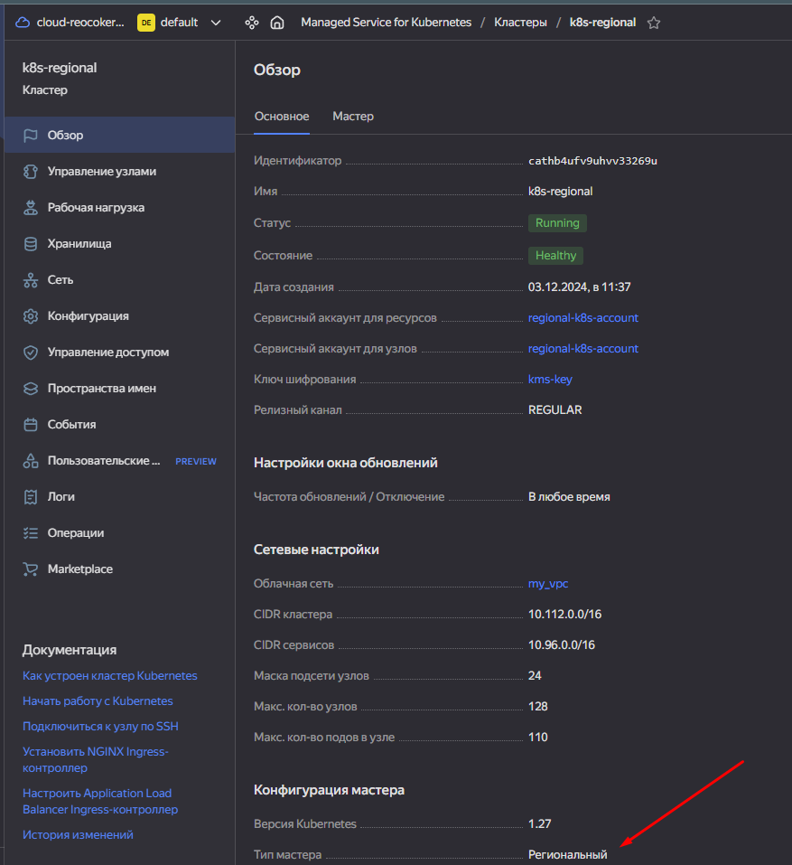
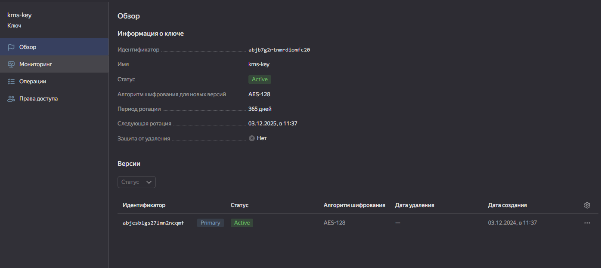
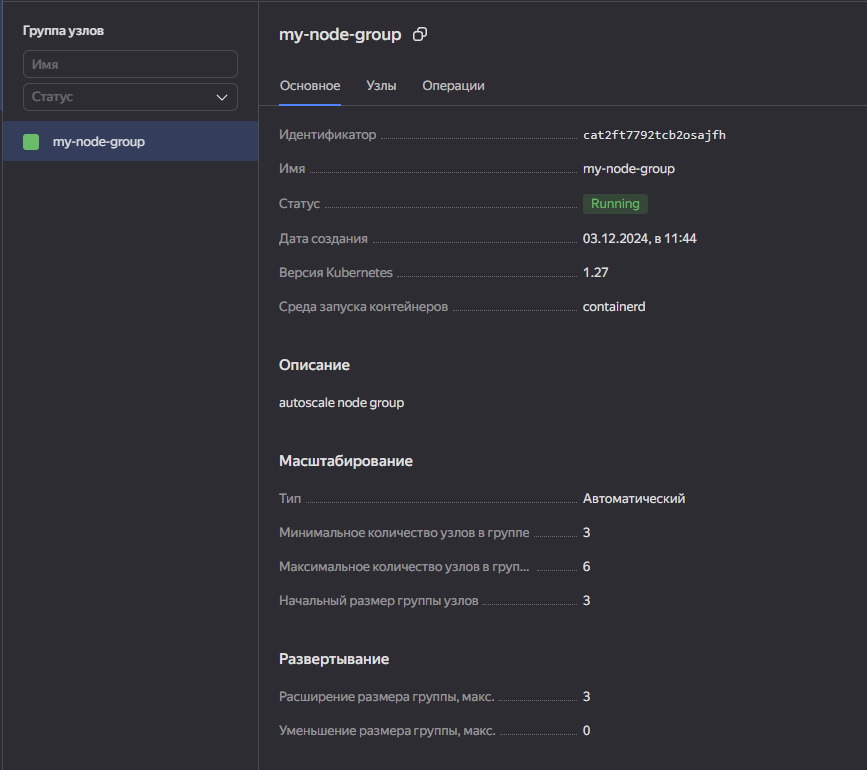

<br>Проверяем работоспособность используя следующий deployment:

```yaml
---
apiVersion: apps/v1
kind: Deployment
metadata:
  name: phpmyadmin-deployment
  labels:
    app: phpmyadmin
spec:
  replicas: 1
  selector:
    matchLabels:
      app: phpmyadmin
  template:
    metadata:
      labels:
        app: phpmyadmin
    spec:
      containers:
        - name: phpmyadmin
          image: phpmyadmin/phpmyadmin:latest
          ports:
            - containerPort: 80
          env:
            - name: PMA_HOST
              value: rc1a-auoag2llctakgc8f.mdb.yandexcloud.net
            - name: PMA_PORT
              value: "3306"
            - name: PMA_USER
              value: "reo"
            - name: PMA_PASSWORD
              value: "qwer1234"
            - name: PMA_PMADB
              value: netology_db
---
apiVersion: v1
kind: Service
metadata:
  name: phpmyadmin-service
spec:
  type: NodePort
#  type: LoadBalancer
  selector:
    app: phpmyadmin
  ports:
  - protocol: TCP
    port: 80
    targetPort: 80
    nodePort: 30500
...
```

<br>Подключаемся к кластеру.Запускаем микросервис phpmyadmin и подключаемся к ранее созданной БД.
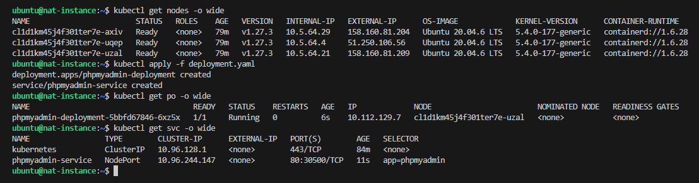
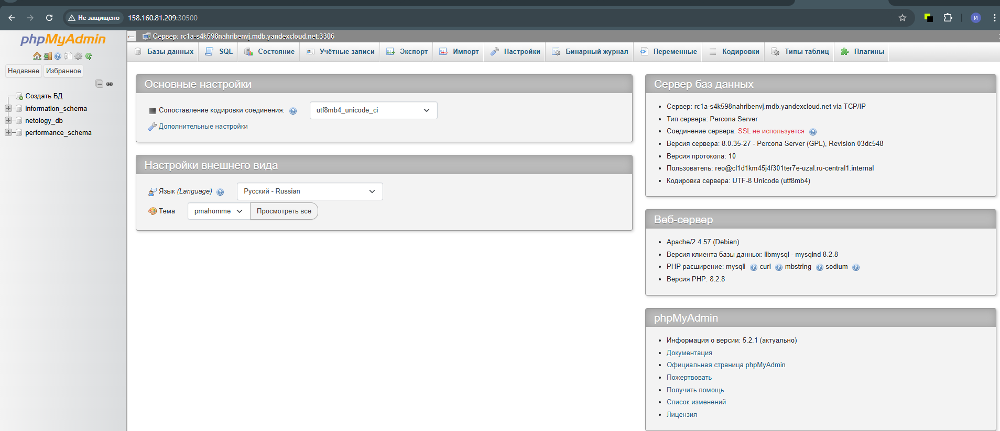

<br>Создаем сервис-типы Load Balancer и подключиться к phpmyadmin.

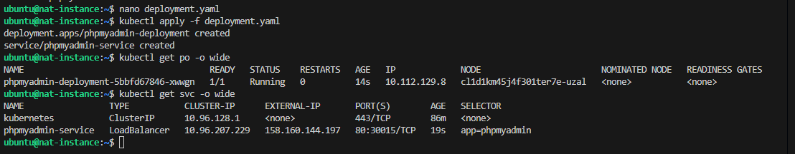
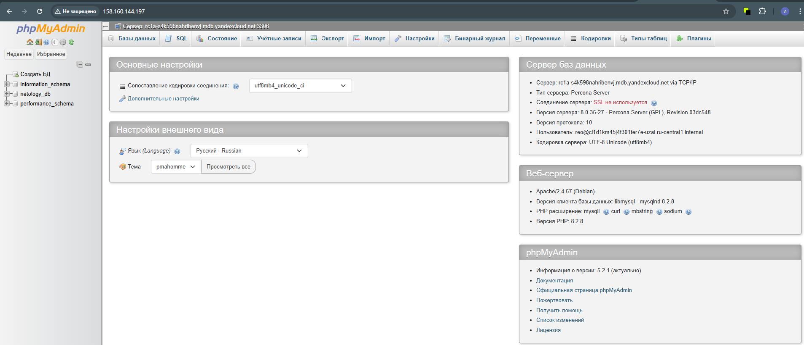

