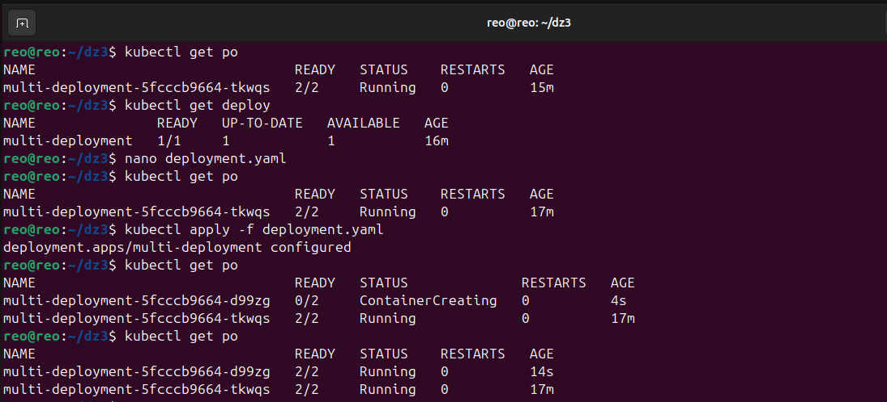
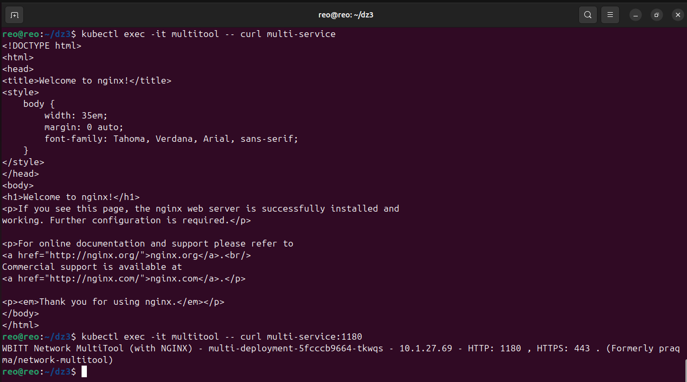
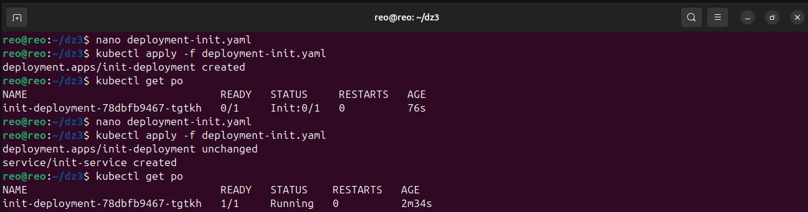

# Домашнее задание к занятию «Запуск приложений в K8S»

### Цель задания

В тестовой среде для работы с Kubernetes, установленной в предыдущем ДЗ, необходимо развернуть Deployment с приложением, состоящим из нескольких контейнеров, и масштабировать его.

------

### Чеклист готовности к домашнему заданию

1. Установленное k8s-решение (например, MicroK8S).
2. Установленный локальный kubectl.
3. Редактор YAML-файлов с подключённым git-репозиторием.

------

### Инструменты и дополнительные материалы, которые пригодятся для выполнения задания

1. [Описание](https://kubernetes.io/docs/concepts/workloads/controllers/deployment/) Deployment и примеры манифестов.
2. [Описание](https://kubernetes.io/docs/concepts/workloads/pods/init-containers/) Init-контейнеров.
3. [Описание](https://github.com/wbitt/Network-MultiTool) Multitool.

------

### Задание 1. Создать Deployment и обеспечить доступ к репликам приложения из другого Pod

1. Создать Deployment приложения, состоящего из двух контейнеров — nginx и multitool. Решить возникшую ошибку.
2. После запуска увеличить количество реплик работающего приложения до 2.
3. Продемонстрировать количество подов до и после масштабирования.
4. Создать Service, который обеспечит доступ до реплик приложений из п.1.
5. Создать отдельный Pod с приложением multitool и убедиться с помощью `curl`, что из пода есть доступ до приложений из п.1.

------

### Задание 2. Создать Deployment и обеспечить старт основного контейнера при выполнении условий

1. Создать Deployment приложения nginx и обеспечить старт контейнера только после того, как будет запущен сервис этого приложения.
2. Убедиться, что nginx не стартует. В качестве Init-контейнера взять busybox.
3. Создать и запустить Service. Убедиться, что Init запустился.
4. Продемонстрировать состояние пода до и после запуска сервиса.

------
### Решение

-  Задание 1:



```yaml
---
apiVersion: apps/v1
kind: Deployment
metadata:
  name: multi-deployment
  labels:
    app: myapp
spec:
  replicas: 2
  selector:
    matchLabels:
      app: myapp
  template:
    metadata:
      labels:
        app: myapp
    spec:
      containers:
      - name: nginx
        image: nginx:1.20
      - name: network-multitool
        image: wbitt/network-multitool
        env:
        - name: HTTP_PORT
          value: "1180"

---
apiVersion: v1
kind: Service
metadata:
  name: multi-service
spec:
  selector:
      app: myapp
  ports:
  - name: nginx
    protocol: TCP
    port: 80
    targetPort: 80
  - name: multitool
    protocol: TCP
    port: 1180
    targetPort: 1180

---
apiVersion: v1
kind: Pod
metadata:
  name: multitool
spec:
  containers:
  - name: multitool
    image: wbitt/network-multitool
...
```



-  Задание 2:



```yaml
---
apiVersion: apps/v1
kind: Deployment
metadata:
  name: init-deployment
  labels:
    app: myapp
spec:
  selector:
    matchLabels:
      app: myapp
  template:
    metadata:
      labels:
        app: myapp
    spec:
      containers:
      - name: nginx
        image: nginx:1.20
      initContainers:
      - name: init
        image: busybox:latest
        command: ['sh', '-c', 'until nslookup init-service.default.svc.cluster.local; do echo waiting for init-service; sleep 2; done;']

---
apiVersion: v1
kind: Service
metadata:
  name: init-service
spec:
  selector:
      app: myapp
  ports:
  - name: nginx
    protocol: TCP
    port: 80
    targetPort: 80
...
```
