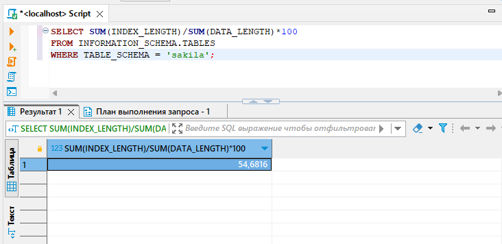

# Домашнее задание к занятию «Индексы»

### Задание 1

Напишите запрос к учебной базе данных, который вернёт процентное отношение общего размера всех индексов к общему размеру всех таблиц.

### Решение 1

```sql
SELECT SUM(INDEX_LENGTH)/SUM(DATA_LENGTH)*100 
FROM INFORMATION_SCHEMA.TABLES
WHERE TABLE_SCHEMA = 'sakila';
```


### Задание 2

Выполните explain analyze следующего запроса:
```sql
select distinct concat(c.last_name, ' ', c.first_name), sum(p.amount) over (partition by c.customer_id, f.title)
from payment p, rental r, customer c, inventory i, film f
where date(p.payment_date) = '2005-07-30' and p.payment_date = r.rental_date and r.customer_id = c.customer_id and i.inventory_id = r.inventory_id
```
- перечислите узкие места;
- оптимизируйте запрос: внесите корректировки по использованию операторов, при необходимости добавьте индексы.

  
```sql
CREATE index pay_date on payment (payment_date)                           
ALTER table payment  drop index pay_date
EXPLAIN ANALYZE
select distinct concat(c.last_name, ' ', c.first_name), sum(p.amount)  
from payment p
INNER JOIN rental AS r ON  p.payment_date = r.rental_date
INNER JOIN customer AS c ON  r.customer_id = c.customer_id
INNER JOIN inventory AS i ON  i.inventory_id = r.inventory_id
where date(p.payment_date) = '2005-07-30' and p.payment_date = r.rental_date
GROUP BY concat(c.last_name, ' ', c.first_name)
```
## Дополнительные задания (со звёздочкой*)
Эти задания дополнительные, то есть не обязательные к выполнению, и никак не повлияют на получение вами зачёта по этому домашнему заданию. Вы можете их выполнить, если хотите глубже шире разобраться в материале.

### Задание 3*

Самостоятельно изучите, какие типы индексов используются в PostgreSQL. Перечислите те индексы, которые используются в PostgreSQL, а в MySQL — нет.

*Приведите ответ в свободной форме.*
