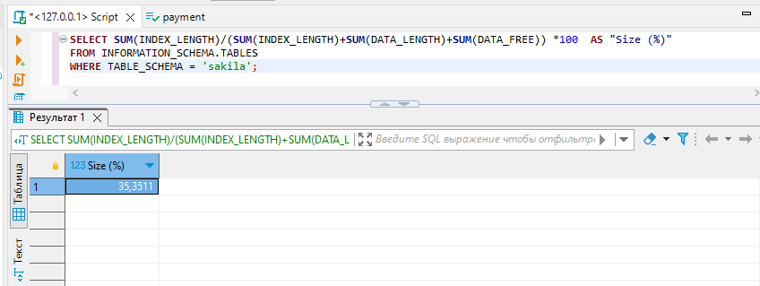

# Домашнее задание к занятию «Индексы»

### Задание 1

Напишите запрос к учебной базе данных, который вернёт процентное отношение общего размера всех индексов к общему размеру всех таблиц.

### Решение 1

```sql
SELECT SUM(INDEX_LENGTH)/(SUM(INDEX_LENGTH)+SUM(DATA_LENGTH)+SUM(DATA_FREE)) *100  AS "Size (%)"
FROM INFORMATION_SCHEMA.TABLES
WHERE TABLE_SCHEMA = 'sakila';
```


### Задание 2

Выполните explain analyze следующего запроса:
```sql
select distinct concat(c.last_name, ' ', c.first_name), sum(p.amount) over (partition by c.customer_id, f.title)
from payment p, rental r, customer c, inventory i, film f
where date(p.payment_date) = '2005-07-30' and p.payment_date = r.rental_date and r.customer_id = c.customer_id and i.inventory_id = r.inventory_id
```
- перечислите узкие места;
- оптимизируйте запрос: внесите корректировки по использованию операторов, при необходимости добавьте индексы.

### Решение 2
Выпонил explain analyze:
```sql
 Limit: 200 row(s)  (cost=0..0 rows=0) (actual time=5565..5565 rows=200 loops=1)
    -> Table scan on <temporary>  (cost=2.5..2.5 rows=0) (actual time=5565..5565 rows=200 loops=1)
        -> Temporary table with deduplication  (cost=0..0 rows=0) (actual time=5565..5565 rows=391 loops=1)
            -> Window aggregate with buffering: sum(payment.amount) OVER (PARTITION BY c.customer_id,f.title )   (actual time=2635..5386 rows=642000 loops=1)
                -> Sort: c.customer_id, f.title  (actual time=2635..2701 rows=642000 loops=1)
                    -> Stream results  (cost=21.1e+6 rows=15.6e+6) (actual time=0.323..1670 rows=642000 loops=1)
                        -> Nested loop inner join  (cost=21.1e+6 rows=15.6e+6) (actual time=0.319..1431 rows=642000 loops=1)
                            -> Nested loop inner join  (cost=19.6e+6 rows=15.6e+6) (actual time=0.316..1239 rows=642000 loops=1)
                                -> Nested loop inner join  (cost=18e+6 rows=15.6e+6) (actual time=0.312..1029 rows=642000 loops=1)
                                    -> Inner hash join (no condition)  (cost=1.54e+6 rows=15.4e+6) (actual time=0.301..45.5 rows=634000 loops=1)
                                        -> Filter: (cast(p.payment_date as date) = '2005-07-30')  (cost=1.61 rows=15400) (actual time=0.0249..5.7 rows=634 loops=1)
                                            -> Table scan on p  (cost=1.61 rows=15400) (actual time=0.0166..4.18 rows=16044 loops=1)
                                        -> Hash
                                            -> Covering index scan on f using idx_title  (cost=112 rows=1000) (actual time=0.0358..0.207 rows=1000 loops=1)
                                    -> Covering index lookup on r using rental_date (rental_date=p.payment_date)  (cost=0.969 rows=1.01) (actual time=978e-6..0.00139 rows=1.01 loops=634000)
                                -> Single-row index lookup on c using PRIMARY (customer_id=r.customer_id)  (cost=250e-6 rows=1) (actual time=150e-6..177e-6 rows=1 loops=642000)
                            -> Single-row covering index lookup on i using PRIMARY (inventory_id=r.inventory_id)  (cost=250e-6 rows=1) (actual time=123e-6..152e-6 rows=1 loops=642000)
```
time=5565..5565

1.Сразу можно сказать ,что сортировка по таблице film занимает много времени , но данные нигде не используются. 
Так же не нужна таблица inventory и условие inventory id. 
Удалим их.

```sql
EXPLAIN ANALYZE 
select distinct concat(c.last_name, ' ', c.first_name), sum(p.amount) over (partition by c.customer_id)
from payment p, rental r, customer c
where date(p.payment_date) = '2005-07-30' and p.payment_date = r.rental_date and r.customer_id = c.customer_id 

-> Limit: 200 row(s)  (cost=0..0 rows=0) (actual time=7.68..7.72 rows=200 loops=1)
    -> Table scan on <temporary>  (cost=2.5..2.5 rows=0) (actual time=7.68..7.7 rows=200 loops=1)
        -> Temporary table with deduplication  (cost=0..0 rows=0) (actual time=7.68..7.68 rows=391 loops=1)
            -> Window aggregate with buffering: sum(payment.amount) OVER (PARTITION BY c.customer_id )   (actual time=6.56..7.54 rows=642 loops=1)
                -> Sort: c.customer_id  (actual time=6.54..6.58 rows=642 loops=1)
                    -> Stream results  (cost=23499 rows=15590) (actual time=0.0615..6.41 rows=642 loops=1)
                        -> Nested loop inner join  (cost=23499 rows=15590) (actual time=0.0572..6.22 rows=642 loops=1)
                            -> Nested loop inner join  (cost=18042 rows=15590) (actual time=0.0528..5.51 rows=642 loops=1)
                                -> Filter: (cast(p.payment_date as date) = '2005-07-30')  (cost=1564 rows=15400) (actual time=0.0397..4.37 rows=634 loops=1)
                                    -> Table scan on p  (cost=1564 rows=15400) (actual time=0.0309..3.31 rows=16044 loops=1)
                                -> Covering index lookup on r using rental_date (rental_date=p.payment_date)  (cost=0.969 rows=1.01) (actual time=0.00127..0.00166 rows=1.01 loops=634)
                            -> Single-row index lookup on c using PRIMARY (customer_id=r.customer_id)  (cost=0.25 rows=1) (actual time=931e-6..957e-6 rows=1 loops=642)

```
time=7.68..7.72

2. Я бы заменил оконную функцию на GOUP BY , так как partition by не уменьшает количество строк, а возвращает столько же значений, сколько получил на вход.

```sql
EXPLAIN ANALYZE 
SELECT  DISTINCT  CONCAT(c.last_name, ' ', c.first_name) AS Client,
SUM(p.amount) AS 'Sum' 
FROM  payment p, rental r, customer c
WHERE  date(p.payment_date) = '2005-07-30' AND p.payment_date = r.rental_date AND r.customer_id = c.customer_id 
GROUP BY Client

-> Limit: 200 row(s)  (actual time=6.4..6.43 rows=200 loops=1)
    -> Table scan on <temporary>  (actual time=6.4..6.42 rows=200 loops=1)
        -> Aggregate using temporary table  (actual time=6.4..6.4 rows=391 loops=1)
            -> Nested loop inner join  (cost=23499 rows=15590) (actual time=0.0587..5.93 rows=642 loops=1)
                -> Nested loop inner join  (cost=18042 rows=15590) (actual time=0.0534..5.35 rows=642 loops=1)
                    -> Filter: (cast(p.payment_date as date) = '2005-07-30')  (cost=1564 rows=15400) (actual time=0.0412..4.36 rows=634 loops=1)
                        -> Table scan on p  (cost=1564 rows=15400) (actual time=0.0323..3.3 rows=16044 loops=1)
                    -> Covering index lookup on r using rental_date (rental_date=p.payment_date)  (cost=0.969 rows=1.01) (actual time=0.00102..0.00142 rows=1.01 loops=634)
                -> Single-row index lookup on c using PRIMARY (customer_id=r.customer_id)  (cost=0.25 rows=1) (actual time=752e-6..778e-6 rows=1 loops=642)
```
time=6.4..6.43


## Дополнительные задания (со звёздочкой*)
Эти задания дополнительные, то есть не обязательные к выполнению, и никак не повлияют на получение вами зачёта по этому домашнему заданию. Вы можете их выполнить, если хотите глубже шире разобраться в материале.

### Задание 3*

Самостоятельно изучите, какие типы индексов используются в PostgreSQL. Перечислите те индексы, которые используются в PostgreSQL, а в MySQL — нет.

*Приведите ответ в свободной форме.*

GiST, SP-GiST, GIN и BRIN
