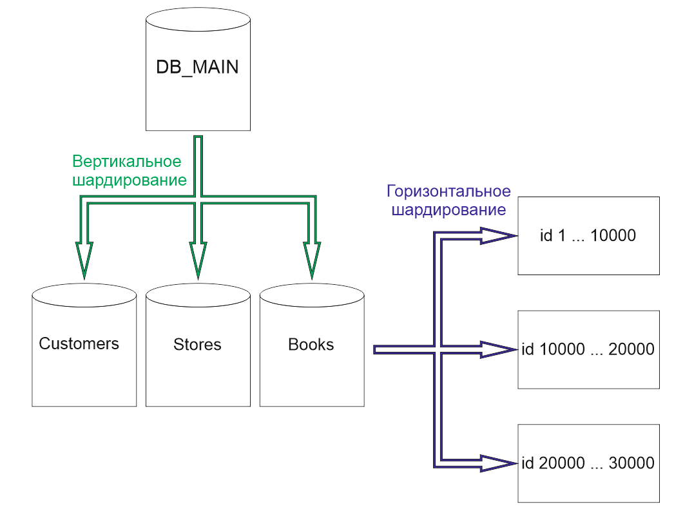

# Домашнее задание к занятию «Репликация и масштабирование. Часть 2»

---

### Задание 1

Опишите основные преимущества использования масштабирования методами:

- активный master-сервер и пассивный репликационный slave-сервер; 
- master-сервер и несколько slave-серверов;
- активный сервер со специальным механизмом репликации — distributed replicated block device (DRBD);
- SAN-кластер.

*Дайте ответ в свободной форме.*

### Решение 1.

1) Aктивный master-сервер и пассивный репликационный slave-сервер:

В данном случае  slave-сервер является копией master-сервера , которую можно использовать для чтения данных. К преимуществам можно отнести простую настройку и безопасность данных за счет наличия копии.

2) Master-сервер и несколько slave-серверов:

Такое масштабирование  позволяет решить две задачи: выдержать большую нагрузку и повысить отказоустойчивость системы.

3) Aктивный сервер со специальным механизмом репликации — distributed replicated block device (DRBD):

В данном случае имеем повышение отказоустройчивасти, так как на нескольких серверах можем иметь копии данных (БД) и в случае выхода из строя основного сервера, мы можем перемонтировать диск с базой данных на другом сервере и продолжить работать с ним как с основным сервером.

4) SAN-кластер:

При использовании SAN-кластер решения получаем повышение отказоустойчивости и производительности, так как в системе должны быть избытычные (дублирующие) узлы, так же такую систему хранения данных проще обслужить или обновить на уровне железа.

---

### Задание 2

Разработайте план для выполнения горизонтального и вертикального шаринга базы данных. База данных состоит из трёх таблиц: 

- пользователи, 
- книги, 
- магазины (столбцы произвольно). 

Опишите принципы построения системы и их разграничение или разбивку между базами данных.

*Пришлите блоксхему, где и что будет располагаться. Опишите, в каких режимах будут работать сервера.* 

### Решение 2

Воспользуясь вертикальным шардингом разобьем общую БД на отдельные -  Books, Stores, Customers. Вероятно , книг будет много , в таком случае c БД Books произведем горизонтальное разбиение данных (горизонтальный шардинг). Использовать будем шардинг на основе диапазона (Range-based sharding). Этот алгоритм использует упорядоченные столбцы, такие как целые числа, временные метки, для разделения строк. В нашем случае, столбец идентификатора книги будет используется для разделения диапазона: идентификаторы книги 1 и 10000 находятся в шарде №1, идентификаторы пользователей 10000 и 20000 — в шарде №2, 20000 - 30000 в шарде №3.

## Дополнительные задания (со звёздочкой*)
Эти задания дополнительные, то есть не обязательные к выполнению, и никак не повлияют на получение вами зачёта по этому домашнему заданию. Вы можете их выполнить, если хотите глубже шире разобраться в материале.

---
### Задание 3*

Выполните настройку выбранных методов шардинга из задания 2.

*Пришлите конфиг Docker и SQL скрипт с командами для базы данных*.
