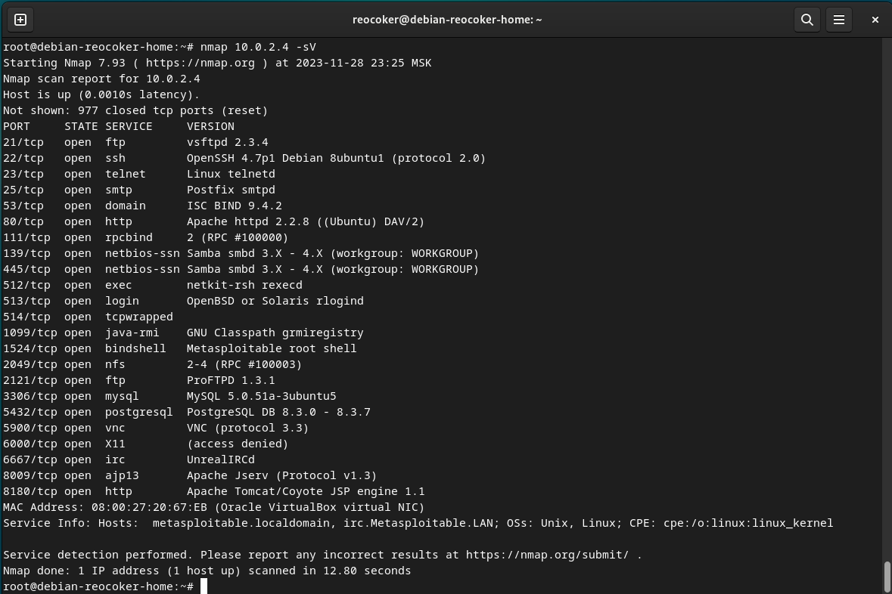
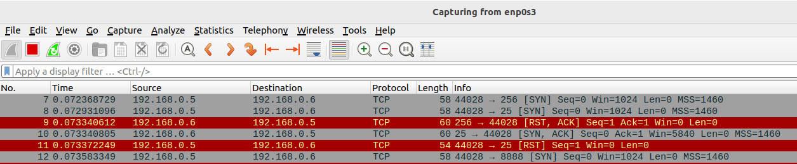
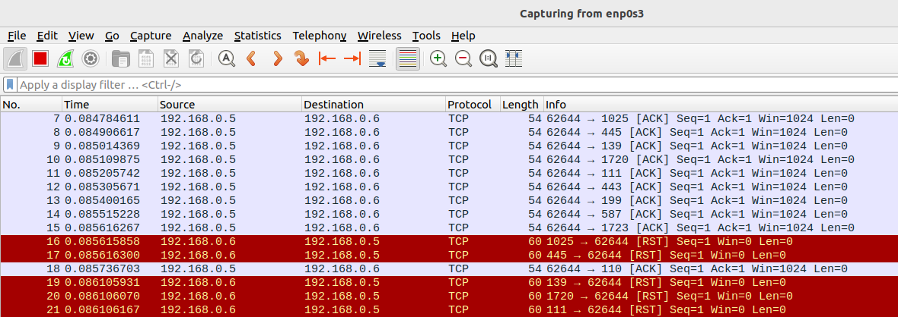
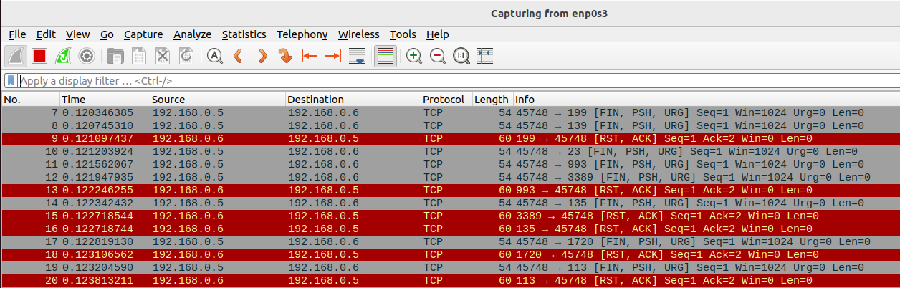
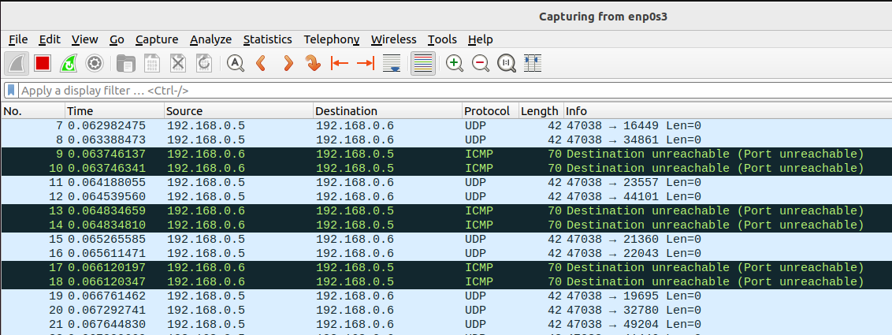

# Домашнее задание к занятию «Уязвимости и атаки на информационные системы» Комиссаров Игорь

### Задание 1

Скачайте и установите виртуальную машину Metasploitable: https://sourceforge.net/projects/metasploitable/.

Это типовая ОС для экспериментов в области информационной безопасности, с которой следует начать при анализе уязвимостей.

Просканируйте эту виртуальную машину, используя **nmap**.

Попробуйте найти уязвимости, которым подвержена эта виртуальная машина.

Сами уязвимости можно поискать на сайте https://www.exploit-db.com/.

Для этого нужно в поиске ввести название сетевой службы, обнаруженной на атакуемой машине, и выбрать подходящие по версии уязвимости.

Ответьте на следующие вопросы:

- Какие сетевые службы в ней разрешены?
- Какие уязвимости были вами обнаружены? (список со ссылками: достаточно трёх уязвимостей)
  
*Приведите ответ в свободной форме.*  

### Решение 1



[vsftpd 2.3.4 - Backdoor Command Execution](https://www.exploit-db.com/exploits/49757)

[ProFTPd 1.3 - 'mod_sql' 'Username' SQL Injection](https://www.exploit-db.com/exploits/32798)

[PostgreSQL 8.3.6 - Low Cost Function Information Disclosure](https://www.exploit-db.com/exploits/32847)

### Задание 2

Проведите сканирование Metasploitable в режимах SYN, FIN, Xmas, UDP.

Запишите сеансы сканирования в Wireshark.

Ответьте на следующие вопросы:

- Чем отличаются эти режимы сканирования с точки зрения сетевого трафика?
- Как отвечает сервер?

*Приведите ответ в свободной форме.*

### Решение 2

**SYN** - на порты отправляется SYN-пакет, как бы намереваясь открыть настоящее соединение, и ожидает ответ. Наличие флагов SYN|ACK в ответе указывает на то, что порт удаленной машины открыт. Если в ответ приходит RST пакет, то порт закрыт.

```
nmap 192.168.0.6 -sS
```


**FIN** - на порты отправляется FIN-пакет ( в TCP заголовок ставится флаг FIN). Если в ответ приходит RST пакет, то порт закрыт. Отсутствие ответа означает, что порт открыт.

```
nmap 192.168.0.6 -sA
```



**Xmas** - TCP-пакеты отсылаются с установленными флагами PSH, URG и FIN.  Если в ответ приходит RST пакет, то порт закрыт. Отсутствие ответа означает, что порт открыт.

```
nmap 192.168.0.6 -sX
```



**UDP** - на порты  отправляется UDP-пакет без данных для определения доступности.Если ответ ICMP-сообщение "port unreacable", то порт закрыт. Отсутствие ответа означает, что порт открыт.

```
nmap 192.168.0.6 -sU
```


